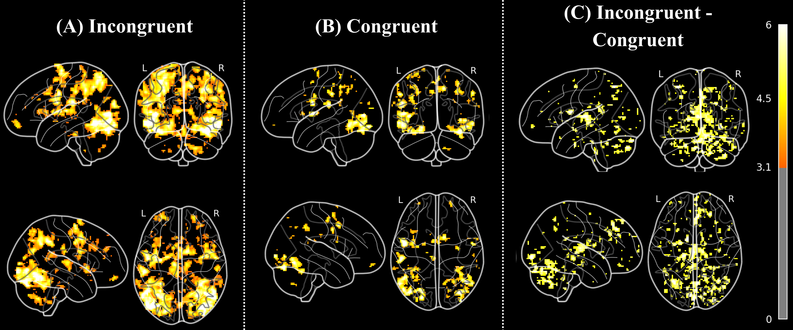
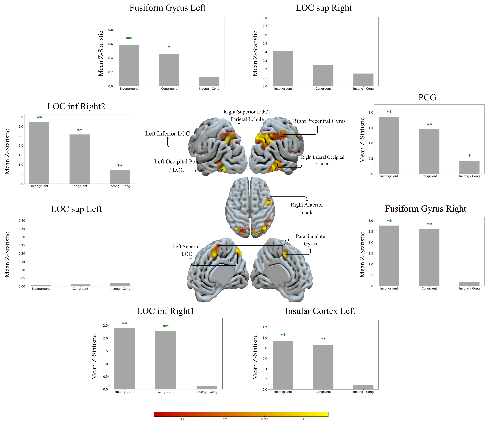

# 🧠 fMRI Study of Cognitive Control in the Flanker Task

**Dataset:** NYU Slow Flanker (ds000102) | **N = 26 participants**

> A complete, reproducible FSL-based fMRI analysis pipeline investigating the neural substrates of cognitive control and interference resolution using the Eriksen Flanker paradigm.

---

## 📋 Table of Contents

- [Overview](#overview)
- [Task Design](#task-design)
- [Pipeline Summary](#pipeline-summary)
- [First-Level Analysis](#first-level-analysis)
- [Second-Level Analysis](#second-level-analysis)
- [Third-Level Analysis](#third-level-analysis)
- [ROI Analysis](#roi-analysis)
- [Key Results](#key-results)
- [Acknowledgements](#acknowledgements)

---

## Overview

This project implements a full three-level fMRI analysis pipeline using **FSL (FMRIB Software Library)** on the NYU Slow Flanker dataset. The goal is to identify brain regions involved in resolving cognitive conflict — specifically those differentially activated when participants encounter **incongruent** versus **congruent** flanking stimuli.

The analysis pipeline includes:
- MRIQC-based quality control
- FSL preprocessing (BET, MCFLIRT, smoothing, registration)
- Three-level GLM modelling (first → second → third level)
- Cluster-corrected group inference using FLAME 1
- ROI analysis using both anatomical and spherical masks

---

## Task Design

The **Eriksen Flanker Task** requires participants to respond to a central target arrow while ignoring surrounding flanking distractors.

| Condition | Stimulus | Cognitive Load |
|-----------|----------|---------------|
| **Congruent** | `>>>>> >>>>>` | Low — flankers match target |
| **Incongruent** | `>>>>> <>>>>` | High — flankers conflict with target |

- **24 trials per run** (12 congruent, 12 incongruent)
- **Stimulus duration:** 2000 ms
- **2 functional runs** per participant, 146 volumes each
- **TR = 2000 ms**, **TE = 30 ms**, Voxel size: 3×3×4 mm

---

## Pipeline Summary

```
Raw BOLD (4D EPI)
      │
      ▼
┌─────────────────┐
│  Brain          │  BET  │  f = 0.2–0.3
│  Extraction     │
└────────┬────────┘
         │
         ▼
┌─────────────────┐
│  Motion         │  MCFLIRT  │  Realign to middle volume
│  Correction     │
└────────┬────────┘
         │
         ▼
┌─────────────────┐
│  Slice-Timing   │  Temporal derivatives in GLM
│  Correction     │
└────────┬────────┘
         │
         ▼
┌─────────────────┐
│  Spatial        │  Gaussian FWHM smoothing
│  Smoothing      │
└────────┬────────┘
         │
         ▼
┌─────────────────┐
│  Registration   │  EPI → T1 (12 DOF)  →  MNI152
│  & Normaliz.    │
└────────┬────────┘
         │
         ▼
┌─────────────────┐
│  First-Level    │  GLM per run per subject
│  GLM            │
└────────┬────────┘
         │
         ▼
┌─────────────────┐
│  Second-Level   │  Fixed Effects — within-subject aggregation
│  GLM            │
└────────┬────────┘
         │
         ▼
┌─────────────────┐
│  Third-Level    │  FLAME 1 — group population inference
│  GLM            │
└────────┬────────┘
         │
         ▼
   Cluster-corrected Z-maps  (Z > 3.1, p < 0.05)
         │
         ▼
      ROI Analysis
```


## First-Level Analysis

Each participant's two functional runs were modelled independently using the **General Linear Model (GLM)**:

$$Y = X\beta + \epsilon$$

**Three contrasts were defined per run:**

| Contrast | Vector | Description |
|----------|--------|-------------|
| COPE 1 | `[1, 0]` | Incongruent > Baseline |
| COPE 2 | `[0, 1]` | Congruent > Baseline |
| COPE 3 | `[1, −1]` | Incongruent > Congruent |

**Thresholding:** Z > 3.1, cluster-corrected p < 0.05

### 🖼️ First-Level Result


*Fig: Rendered Z-statistic maps for COPE1 (Incongruent > Baseline), COPE2 (Congruent > Baseline), and COPE3 (Incongruent > Congruent) for a representative subject and run.*

---

## Second-Level Analysis

A **Fixed Effects** model aggregated COPE images across the two runs within each participant, increasing intra-subject SNR before group inference.

- **Design matrix:** 52 × 26 sparse EV matrix (diagonal contrasts)
- **Output:** 26 averaged statistical maps — one per subject per contrast

### 🖼️ Second-Level Result — Glass Brain



*Fig: Glass-brain views of averaged COPE maps across all subjects. (A) COPE1: Incongruent > Baseline — broad bilateral occipital and prefrontal engagement. (B) COPE2: Congruent > Baseline — similar but less extensive network. (C) COPE3: Incongruent > Congruent — focused conflict-specific fronto-occipital clusters.*

---

## Third-Level Analysis

Group-level inference was performed using **FLAME 1** (Mixed Effects), which weights each subject's contribution inversely to their intra-subject variance.

- **Input:** 26 COPE3 images from second-level
- **Design:** Single-group average (26 × 1 design matrix, EV = 1.0)
- **Thresholding:** Cluster-based GRF correction (Z > 3.1, p < 0.05)

### Significant Clusters — Incongruent > Congruent

| Cluster | Voxels | p-value | Max Z | MNI (x,y,z) | Region | Role |
|---------|--------|---------|-------|-------------|--------|------|
| 8 | 379 | 1.13×10⁻⁶ | 4.28 | (26,−68,50) | Lateral occipital cortex, superior | Visual Spatial Attention |
| 7 | 248 | 7.83×10⁻⁵ | 3.96 | (48,−68,−14) | Lateral occipital cortex, inferior | Visual Object Recognition |
| 6 | 226 | 1.71×10⁻⁴ | 4.47 | (−44,−72,−4) | Lateral occipital cortex, inferior | Visual Object Recognition |
| 5 | 211 | 2.96×10⁻⁴ | 4.13 | (48,12,30) | Inferior frontal gyrus / precentral gyrus | Response Inhibition |
| 4 | 127 | 8.43×10⁻³ | 3.77 | (−4,16,46) | Paracingulate gyrus / superior frontal gyrus | Conflict Detection |
| 3 | 125 | 9.20×10⁻³ | 3.83 | (−24,−64,52) | Lateral occipital cortex / superior parietal lobule | Visual Spatial Attention |
| 2 | 101 | 2.72×10⁻² | 4.49 | (−42,−88,−6) | Lateral occipital cortex / occipital pole | Visual Object Recognition |
| 1 | 97 | 3.27×10⁻² | 4.06 | (32,22,−6) | Insular cortex / frontal orbital cortex | Task Engagement / Salience |

### 🖼️ Third-Level Group Activation Maps


*Fig: Third-level FLAME 1 group activation maps rendered on an inflated MNI152 brain. (A) Group: Incongruent > Baseline. (B) Group: Congruent > Baseline. (C) Group: Incongruent − Congruent difference — highlighting conflict-specific regions including bilateral LOC, right IFG, PCG, and insular cortex.*

---

## ROI Analysis

Z-statistics were extracted from four regions of interest using two complementary masking approaches:

| Region | Abbreviation | Functional Role |
|--------|-------------|-----------------|
| Lateral Occipital Cortex (superior) | LOC-sup | Visual Spatial Attention |
| Lateral Occipital Cortex (inferior) | LOC-inf | Visual Object Recognition |
| Paracingulate Gyrus | PCG | Conflict Monitoring |
| Insular Cortex | Insula | Salience / Task Engagement |

### Method 1 — Anatomical Masks (`fslmeants` + one-sample t-test)
- Both LOC divisions: **significant** (p < 0.05) in COPE3
- PCG and Insula: **non-significant** — large mask extent diluted focal signal

### Method 2 — Spherical Masks (5 mm radius, peak coordinates)
- PCG and Insula: **significant** (p < 0.001) — confirming true activation, not absence of effect
- All regions: incongruent condition consistently produced **higher mean Z-statistics**

### 🖼️ ROI Analysis Results



*Fig: Mean Z-statistics extracted per ROI for all three contrasts — COPE1 (Incongruent > Baseline), COPE2 (Congruent > Baseline), and COPE3 (Incongruent − Congruent) — using both anatomical and spherical mask methods. Incongruent trials consistently drive higher activation across all regions.*

---

## Key Results

- **8 significant clusters** identified in the Incongruent > Congruent contrast
- **Dominant activation** in bilateral lateral occipital cortex — conflict resolution begins at the perceptual stage, not purely executive
- **Right IFG** (Z = 4.13) confirms canonical response inhibition network engagement
- **PCG** activation (conflict monitoring) only detectable with spatially precise spherical ROIs — highlighting the importance of ROI methodology choice
- **Insular cortex** reflects task salience and error signalling under increased cognitive demand
- The incongruent condition consistently elicited **higher BOLD responses** across all regions and both ROI methods

---

## Acknowledgments

This project was completed as part of the Neuroimaging course supervised by [Dr. Meena M. Makary](https://scholar.google.co.kr/citations?user=y_8D7KEAAAAJ&hl=en
) and [Eng. Aya Eyad](https://github.com/Ayamachii) at Cairo University.


The project and scripts were inspired by and builds upon the knowledge gained from the "Andy's Brain Book fMRI Short Course" by [Andrew Jahn](https://medicine.umich.edu/dept/radiology/andrew-jahn-phd)

Course Link: [Andy's Brain Book fMRI Short Course](https://andysbrainbook.readthedocs.io/en/latest/fMRI_Short_Course/fMRI_Intro.html)


## 🔗 Repository
For a **step-by-step walkthrough, detailed results and explanations**, check the [FSL-Report-RaghadAbdelhameeed.pdf](FSL-Report-RaghadAbdelhameeed.pdf) in the repository
.

All scripts and processing results are publicly available at:  
👉 [https://github.com/RaghadAbdelhameed/fMRI-Study-of-Cognitive-Control-in-the-Flanker-Task](https://github.com/RaghadAbdelhameed/fMRI-Study-of-Cognitive-Control-in-the-Flanker-Task)

---
